----------

### Processamento de Linguagem Natural —Leitura e Limpeza dos Dados

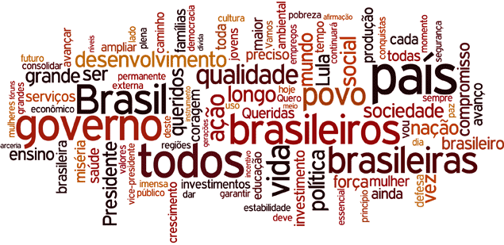

[https://www1.folha.uol.com.br/poder/853675-veja-nuvem-de-palavras-com-os-termos-mais-recorrentes-nos-discursos-de-dilma.shtml](https://www1.folha.uol.com.br/poder/853675-veja-nuvem-de-palavras-com-os-termos-mais-recorrentes-nos-discursos-de-dilma.shtml)

  

Processamento de Linguagem Natural (PLN) é um dos ramos de estudo ligado ao aprendizado de máquina, voltado ao desenvolvimento de modelos computacionais capazes de extrair informações contidas em materiais codificados em uma linguagem natural, como documentos escritos, áudio, textos extraídos de imagens, entre outros.

Essa área de estudo vem recebendo grande enfoque tanto no âmbito acadêmico como no âmbito comercial pela sua grande gama de aplicações como nos sistemas de diálogo, extração de informações de documentos, sumarização automática, análise de sentimentos, tradução, categorização de textos, etc.

Nessa primeira postagem, pfalarei um pouco longo dessa série de artigos será desenvolvida, utilizando a linguagem Python, uma aplicação voltada à categorização de texto com o objetivo de abordar alguns dos pontos chave para o desenvolvimento de uma aplicação PLN.

Para esse desenvolvimento serão tratadas as seguintes etapas: leitura dos dados de uma base, análise e entendimento de como os dados estão estruturados, normalização e limpeza dos dados, analise dos dados normalizados para o levantamento de hipóteses, criação do modelo, testes e aperfeiçoamento do modelo criado.

Nessa primeira parte serão trabalhadas as 3 primeiras etapas desse modelo que serão aplicadas sobre o _dataset_ que pode ser encontrado nesse [local](https://github.com/rogersdepelle/OffComBR). Ao final desse artigo a base de dados transformada deverá estar preparada para o levantamento de hipóteses, a submissão da base a um modelo de aprendizado de máquina e, pôr fim, a submissão desse modelo aos testes, passos que serão trabalhados nas próximas postagens.

### LEITURA DOS DADOS DE UMA DATASET

O _dataset_ em questão possui uma base com 1250 comentários dos quais 419 foram sinalizados como ofensivos por avaliadores que participaram de sua criação. Os dados foram disponibilizados originalmente no formato _arff_ e foram convertidos para o formato _csv_ utilizando este [site](https://pulipulichen.github.io/jieba-js/weka/arff2csv/). Essa base será, a princípio, utilizada para a criação de um modelo capaz de julgar se um determinado comentário é ofensivo ou não.

----------

No código abaixo foi utilizada a biblioteca pandas tanto para a extração dos dados salvos em um arquivo no formato _csv_ quanto para a realização de alguns procedimentos na base como o renomeio das colunas, para facilitar a manipulação dos dados, e a criação de uma coluna do tipo inteiro com valores binário para a categorização dos comentários entre ofensivos ‘1’ e não ofensivos ‘0’ substituindo a coluna original de categorização no formato ‘_yes’_ ofensivo e ‘_no’_ não ofensivo.

Com os dados carregados, podemos iniciar sua análise buscando entender como o _dataset_ está estruturado.

### ANÁLISE DO DATASET

Essa análise preliminar dos dados nos permitirá, como já dito, entender como eles estão estruturados e distribuídos além de ser necessária para o levantamento das ações que que deverão ser aplicadas para a normalização da base. O primeiro passo nessa análise é verificar se existem dados nulos no _dataset_ uma vez que esses dados podem comprometer o funcionamento do modelo:

Como se pode ver, existem 1250 registros no total e nenhum deles é nulo.

----------

Para o início da análise propriamente dita, optei por utilizar a biblioteca _wordcloud_ que nos permite criar um tipo de plotagem chamado [nuvem de palavras](https://en.wikipedia.org/wiki/Tag_cloud) que apresenta de forma visual os termos em destaque com maior relevância, maior frequência, com relação a uma base de dados fornecida.

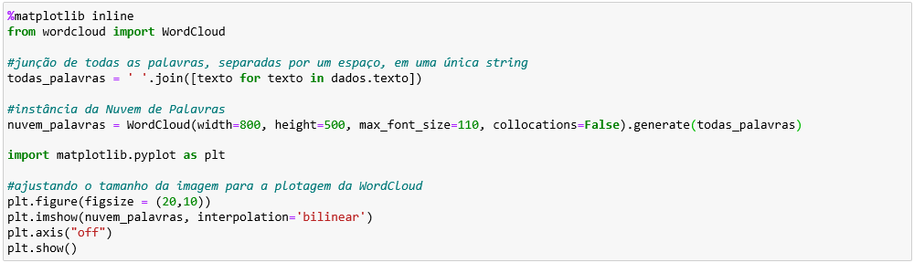

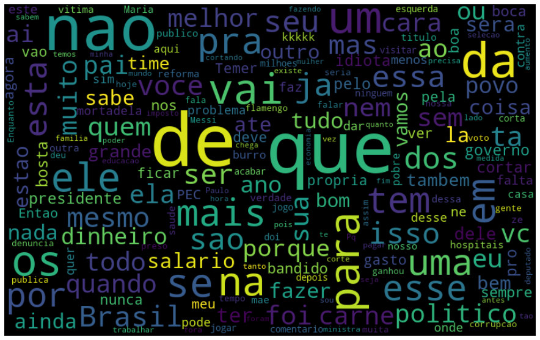

Analisando a plotagem acima, pode-se notar que a maior parte das palavras destacadas são palavras sem muita relevância semântica para a categorização de um comentário como ofensivo ou não enquanto palavras mais relevantes para esse propósito, como a ofensa “burro”, possui um destaque significativamente menor.

Após essa análise de caráter mais geral das palavras mais frequentes de todo o _dataset_, podemos realizar uma análise localizada e, para isso, irei plotar dois gráficos de barra que destacarão as palavras mais relevantes separadas entre os dois grupos, comentários ofensivas e não ofensivas.

Por se tratar de uma operação que será realizada frequentemente nas análises dos dados, foi criada a função abaixo que retorna um DataFrame contendo a palavra e sua frequência referente ao número de aparições do grupo fornecido como parâmetros.

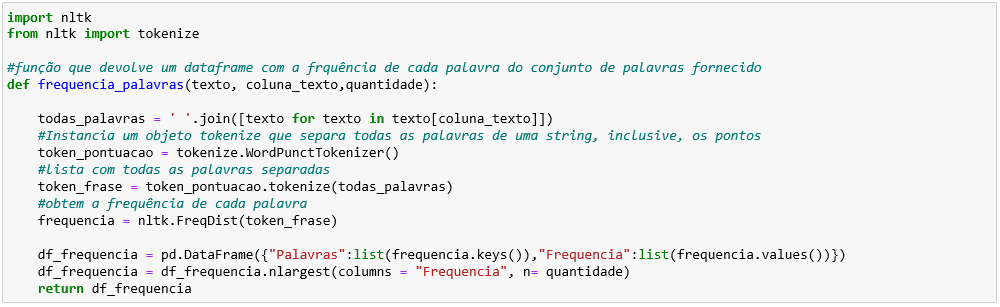

Foi utilizada na função acima a ferramenta da biblioteca [_nltk_](https://www.nltk.org/) chamada _tokenize_ que nos permite quebrar uma _string_ em uma lista de palavras separadas, separando inclusive a pontuação como virgulas e pontos finais. Ainda da biblioteca _nltk_, foi utilizada a função _FreqDist_ que retorna um dicionário com as palavras, sem repetição, e suas respectivas frequências.

Com essa função, é possível plotar os gráficos de barras seguindo o código abaixo:

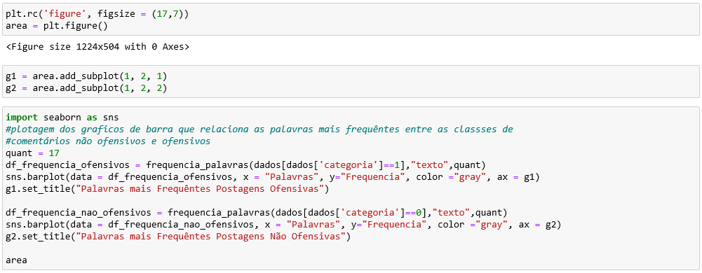

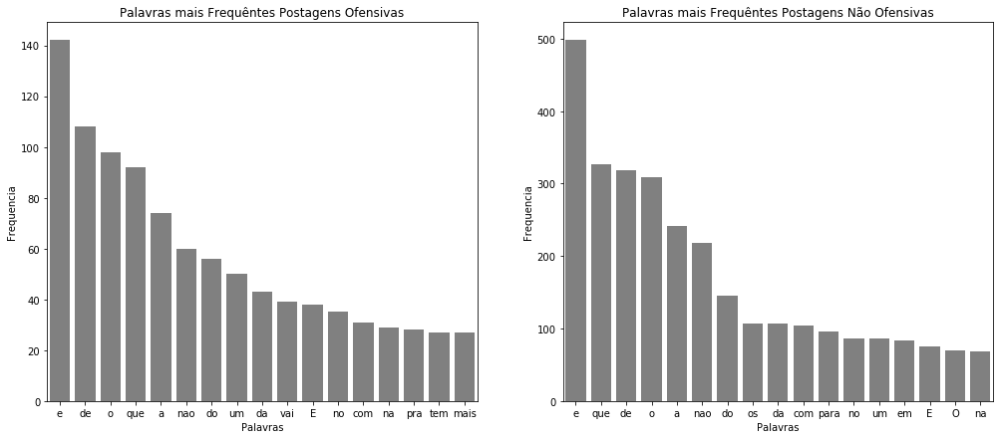

Pelo gráfico de barras fica fácil perceber que a maior parte das palavras de ambos os grupos são iguais o que acaba prejudicando, ou até mesmo inviabilizando, a tarefa de identificar comentários ofensivos. Outro ponto crítico é a diferenciação de palavras com maiúsculas e minúsculas como no caso da vogal “o” minúsculo e “O” maiúsculo tratadas como sendo palavras distintas o que acaba por aumentar ainda mais a dispersão da base diminuindo a eficácia do modelo.

Agora que entendemos melhor a base de dados e sabemos quais problemas precisamos eliminar partiremos para sua limpeza e normalização.

### LIMPEZA DOS DADOS

Para iniciar esta etapa de limpeza dos dados vamos começar criando uma lista com as palavras consideradas pouco relevantes semanticamente as _stopwords._ A biblioteca nltk fornece uma lista de _stopwords_ em português mas, além dessa lista, podemos acrescentar outras palavras que se destacam nas análises da base de dados com que se está trabalhando “outras_palavras_irrelevantes”. Acrescentei também na lista das _stopwords_ todos os caracteres especiais que pouco contribuirão para a categorização do comentário e que podem ser obtidos por meio da biblioteca _string_. No código abaixo a lista das _stopwords_ é criada:

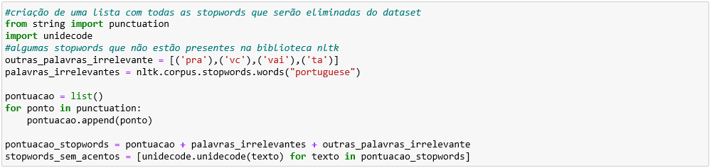

Com a lista de _stopwords_ podemos iniciar a limpeza dos dados com as seguintes ações:

-   retirando todos as acentuações, muitos dos comentários possuem erros gramaticais envolvendo a presença ou a ausência de acentos e, por essa razão, é mais garantido eliminar os acentos das palavras para a análise;
-   transformação de todos os caracteres em minúsculos, evitando o problema de duplicações de palavras;
-   eliminando as _stopwords_ da base de dados;

As postagens que já passaram pelo processo de limpeza são salvas em uma nova coluna chamada “tratamento”. No código abaixo são realizadas as ações mencionadas acima:

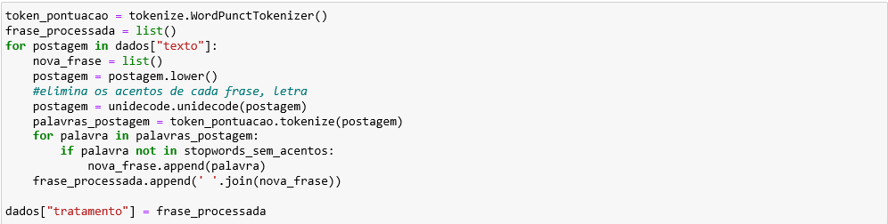

A seguir vamos plotar novamente o gráfico de barras com as frequências das palavras em cada grupo utilizando ao invés dos textos originais o texto tratado;

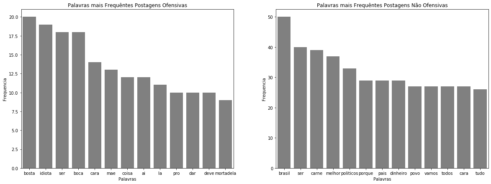

Como se pode ver, as palavras com uma conotação mais ofensiva já figuram entre as mais frequentes no conjunto dos comentários ofensivos, o que é um bom indicativo para o bom funcionamento do modelo. Vale ressaltar que esse processo deve ocorrer diversas vezes, com o acréscimo de novas _stopwords_ até que a base de dados utilizada seja modelada de forma coerente para o funcionamento do modelo.

----------

Uma outra técnica que também pode ser utilizada para a limpeza e normalização dos dados é a “_stemmização_”. Esse processo consiste em reduzir uma palavra ao seu radical, unindo palavras flexionadas e derivadas de um mesmo radical (com o acréscimo de sufixo ou prefixo) que a rigor possuem um valor semântico próximo. Como exemplo temos as palavras ‘amoroso’, ‘amado’ e ‘amada’, no processo de _stemmização_ todas essas palavras são reduzidas ao radical amor e portanto, unidas em uma mesma palavra para a análise de frequência.

A biblioteca _nltk_ fornece também uma ferramenta que aplica o processo de _stemmização_ em _strings_. Segue abaixo o código com essa implementação. Os textos que passaram por esse procedimento serão salvos em uma coluna chamada ‘_tratamento_stemmer’_.

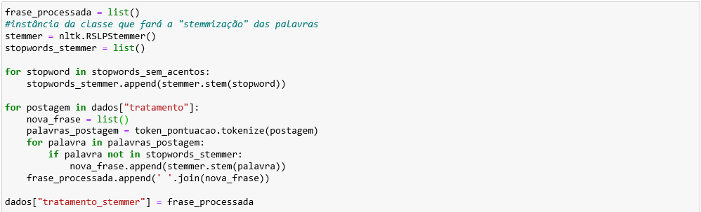

Segue abaixo a plotagem dos gráficos de barra relacionando a frequência das palavras dos dois grupos, ofensivos e não ofensivos, utilizando agora os dados do ‘’_tratamento_stemmer’.:_

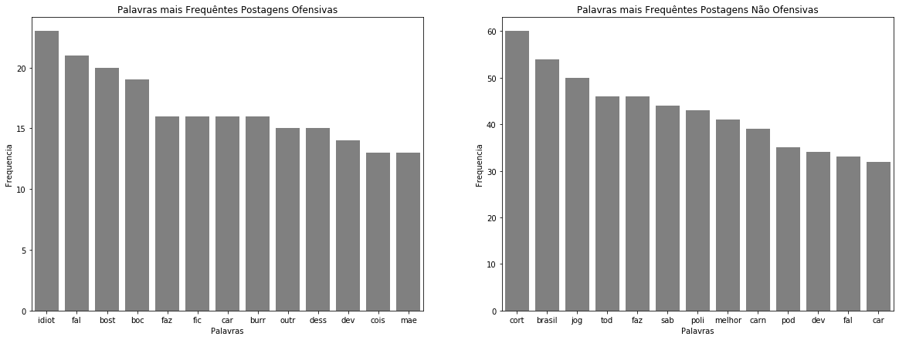

### CONCLUSÃO

Nesse ponto já temos uma base de dados que, a princípio, encontra-se “limpa” e normalizada estando pronta para as próximas etapas da análise, o levantamento de hipóteses e a construção do modelo. É importante frisar, contudo, que as etapas abordadas nesse artigo podem ser refeitas e modificadas de acordo com os resultados das próximas etapas.

Esse artigo teve como objetivo apresentar de forma geral algumas das técnicas utilizadas na leitura dos dados, analise preliminar dos dados e a limpeza do _dataset. A_s demais etapas, como já dito, serão abordadas nas próximas postagens.

----------

Obrigado pela atenção !
